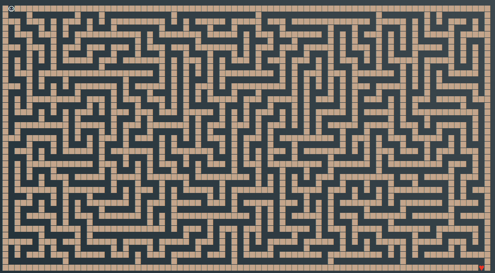

**Reference labyrinth**   

To repository is added Labyrinth(_*).html from where you can copy (other three) labyrinths. The one that is shown as reference is already in path.txt.
 
*Instructions*  
Specify all sequence of every step you take through labyrinth. 
 
As:  
L=Left | R=Right | D=Down | U=Up (DDRULLGDR)  
You need to specify every direction you need to take to come from ☺ to ♥.  
directions = {"L": (-1, 0), "R": (1, 0), "D": (0, 1), "U": (0, -1)}  
You will find final result in Final_result.txt.

Task was part (final task) of MojeDeloHekaton - CTF   
Picture of the labyrinth is added in repo. Page was refreshed every 45 seconds and new picture with new labyrinth appeared.  
To use this code you need to copy labyrinth from webpage (added *.html) to path.txt (in repo), install python 3.x, run main.py and you will get result in Final_result.txt.

****
**ABOUTH LAYBRINTH**  

Labyrinth size = 80 × 40  = 3200 points.  
Crossroad is where path split on two branches - three ways to go from crossroad.  
There is no crossroads with 4 possible ways or ways that lead in circles (only one valid path from ☺ to ♥)
Referenced labyrinth has 82 crossroads, 16 of those are valid (path goes through them)  
For 100 that labyrinths it takes 22 seconds to write down whole path (see algo_speed_test.py in repo).

**HOW IT WORKS**   

- mark wall as "#" and free space as " "
- find start return coordinate where you find "☺"
- find finis return coordinate where you find "♥"
- find way with coordinates to the first crossroad
- specify what is crossroad (3 free ways one wall)
- find all crossroads
- for crossroads that ends with two blind roads (two branches from crossroad hit wall) mark crossroad as wall ("#")
- every iteration you repeat previous action, you will find less valid crossroads
- it takes around 10 iterations to remove all unused (not valid) crossroads
- from every crossroad that is not removed (changed to wall) remove branch that lead to wall and remember two branches that lead to another crossroad or ☺ or ♥  
- compose branch by branch to get coordinates for the whole way
- get direction (D, U, L, R) to go from one coordinate to another
- write final result in file Final_result.txt  

**for more info check comments in main.py**  
